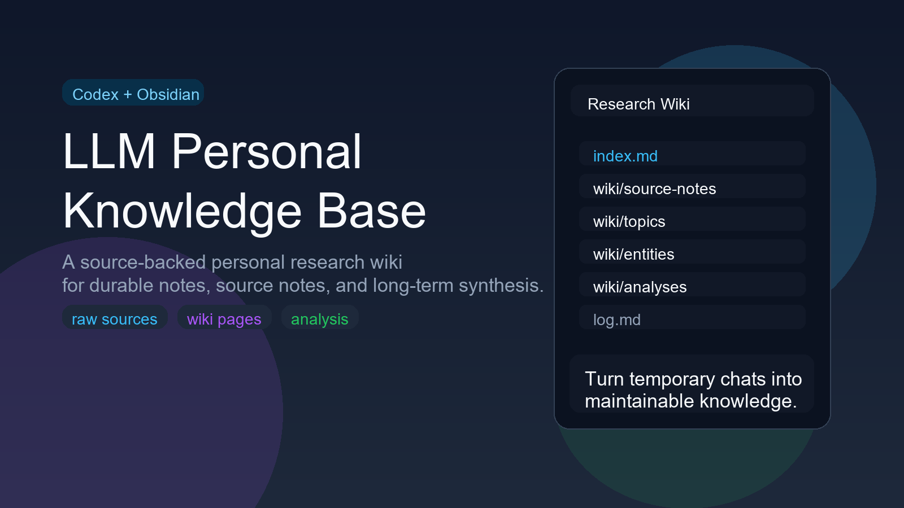
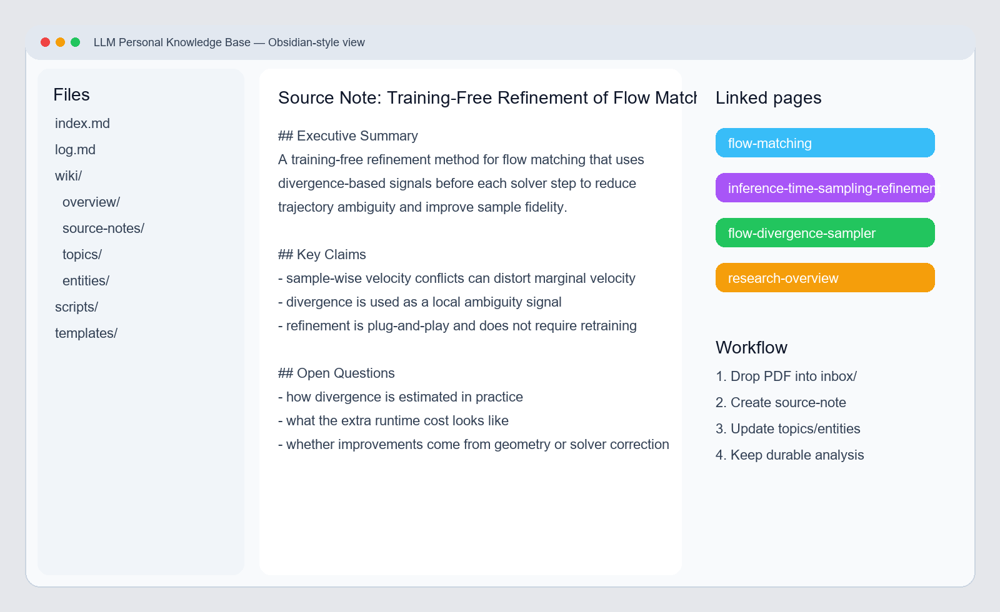

# LLM Personal Knowledge Base



> 一个基于 **Codex + Obsidian** 的、面向研究工作流的个人知识库 / research wiki。

把论文、网页、资料整理和研究问答，逐步沉淀成一个可维护、可追溯、可持续更新的 Markdown 知识库，而不是让它们停留在临时聊天记录里。

## 为什么做这个项目

很多 AI 辅助阅读流程都有同一个问题：

- 当下总结得很好；
- 聊天里也有不少有价值的结论；
- 但这些内容最后没有沉淀成长期可复用的知识。

这个项目就是为了解决这个问题：把“临时对话里的理解”逐步编译成一个长期可维护的知识库。

它强调让研究知识变得：

- **来源可追溯** —— 原始资料和综合结论分开保存；
- **结构可维护** —— topic / entity 页面会被后续来源持续更新；
- **可持续提问** —— 后续问题可以直接基于已有 wiki 继续生长；
- **可审阅** —— 更新过程会写入 `index.md` 和 `log.md`；
- **可移植** —— 全部内容都保持在 Markdown + Obsidian 友好的结构里。

## 适合谁

这个项目尤其适合：

- 需要长期读论文的人；
- 使用 Obsidian 但不想让笔记越来越散的人；
- 想让 AI 不只是“帮忙总结”，而是“帮忙维护知识结构”的人；
- 在意证据边界、来源可追踪和长期复用的人。

## 快速开始

```bash
# 1. 把新资料放进 inbox/
# 2. 如果需要，先规范文件名
python scripts/new_source.py inbox/some-paper.pdf --move

# 3. 让 Codex ingest 并更新 vault
# 4. 需要时运行结构检查
python scripts/lint_wiki.py
```

## 核心思路

- **Codex** 负责整理、吸收、更新、维护；
- **Obsidian** 负责浏览、链接、审阅和长期管理；
- **Git** 负责保留知识演化历史；
- **Markdown** 保证内容可移植、可检查、不过度依赖专有工具。

所以它更像：

> 一个个人研究 wiki / 外部记忆系统

而不是：

> 一个普通的读书笔记文件夹。

## 目录结构

```text
.
├── AGENTS.md                 # Codex / agent 的操作契约
├── README.md                 # 英文说明
├── README.zh-CN.md           # 中文说明
├── index.md                  # 主导航页
├── log.md                    # append-only 操作日志
├── inbox/                    # 新资料投递区
├── raw/
│   ├── sources/              # 原始来源文件（默认视为只读）
│   └── assets/               # 图片或附件资源
├── scripts/
│   ├── new_source.py         # 规范化新来源文件名
│   └── lint_wiki.py          # 检查 wiki 结构健康度
├── templates/                # 各类页面模板
└── wiki/
    ├── overview/             # 总览页
    ├── topics/               # 主题页
    ├── entities/             # 实体页（方法/模型/数据集/作者等）
    ├── source-notes/         # 单篇来源的证据页
    ├── analyses/             # 问题驱动的长期分析页
    └── glossaries/           # 术语页
```

## 现在长什么样



## 各部分分别做什么

### `inbox/`
新材料投递区。

适合放：
- PDF 论文；
- arXiv 摘要快照；
- 网页保存文件；
- 其他待吸收资料。

### `raw/`
原始来源层。

其中：
- `raw/sources/` 保存正式导入后的源材料；
- `raw/assets/` 保存与来源相关的本地图片或附件。

原则上，知识页不要直接引用 raw 文件，而应通过 `source-note` 间接引用。

### `wiki/`
知识层，是这个仓库最核心的部分。

包括：
- `overview/`：记录研究范围、主线判断、核心开放问题；
- `topics/`：围绕一个主题或问题域的页面；
- `entities/`：围绕一个具体对象的页面，比如方法、数据集、作者、组织；
- `source-notes/`：单个来源的结构化吸收页，是证据层；
- `analyses/`：回答过的重要问题、对比结论、长期有效分析；
- `glossaries/`：术语整理页。

### `index.md`
主导航页。

回答问题或计划更新前，agent 应优先读取 `index.md`，因为它承担的是“全局目录”和“当前知识地图”的角色。

### `log.md`
Append-only 操作日志。

用于记录：
- ingest；
- query；
- lint；
- refactor。

这样可以追踪这个知识库是如何一步步长出来的。

## 示例工作流

一个典型的端到端流程可以这样理解：

1. **把新来源放进 `inbox/`**  
   例如一篇 PDF 论文、一个 arXiv 摘要快照、或一份网页 Markdown 导出。
2. **规范化并导入来源**  
   如果你希望 `raw/sources/` 里的文件名稳定统一，可以先运行 `scripts/new_source.py`。
3. **让 Codex ingest**  
   Codex 负责创建一篇 `source-note`，并更新相关 `topic` / `entity` / `overview` 页面，同时刷新 `index.md` 和 `log.md`。
4. **直接基于 vault 提问**  
   后续问题不必每次都从原文重来，而是优先建立在已有 wiki 之上。
5. **把长期有价值的回答沉淀到 `wiki/analyses/`**  
   如果一个比较、结论或综合判断未来还会用到，就把它写成 analysis 页面。
6. **定期运行 lint 保持结构健康**  
   用 `scripts/lint_wiki.py` 检查缺失元数据、断链和结构问题。

简化成一行就是：

```text
inbox/ -> raw/sources/ -> source-note -> topic/entity pages -> analysis -> 持续维护
```

## 推荐工作流

## 1. 导入一篇新资料

先把文件放进 `inbox/`。

如果需要规范文件名，可以运行：

```bash
python scripts/new_source.py inbox/some-paper.pdf --move
```

这个脚本会：
- 生成标准化 slug；
- 给出目标 raw 路径；
- 给出对应 source-note 建议路径；
- 用 `--move` 时把文件移入 `raw/sources/`。

## 2. 让 Codex 吸收它

理想的 ingest 行为应该包括：

- 创建一篇 `source-note`；
- 更新受影响的 `topic` / `entity` / `overview` 页面；
- 更新 `index.md`；
- 在 `log.md` 中追加一条 ingest 记录。

## 3. 直接基于 vault 提问

例如：

- 这篇论文的核心贡献是什么？
- 它和 vault 里已有方法的关系是什么？
- 当前这个主题下还有哪些未解决问题？

更推荐的做法是：
- 先从 `index.md` 和已有 wiki 页面回答；
- 必要时再回到 `source-note`；
- 如果结论值得长期保存，就沉淀成 `wiki/analyses/` 页面。

## 4. 定期体检

运行：

```bash
python scripts/lint_wiki.py
```

它会做一些轻量结构检查，例如：
- frontmatter 是否缺字段；
- 页面是否缺 section heading；
- 是否有明显缺 citation 的页面；
- 是否有 broken wikilink；
- 是否有 orphan page。

注意：它只是轻量检查，不等于内容质量已经足够高。

## 页面类型说明

这个项目区分以下页面类型：

- **overview**：高层研究范围与主线页；
- **topic**：主题页，关注问题域、方向或范式；
- **entity**：实体页，关注方法、模型、数据集、作者、组织等具体对象；
- **source-note**：单篇来源的证据页；
- **analysis**：由问题驱动沉淀下来的长期分析页；
- **glossary**：术语页。

每类页面都应带 frontmatter，并遵循固定章节结构。完整规则见 `AGENTS.md`。

## 推荐提示词

你可以这样让 Codex 工作：

- `Please ingest the new source in inbox/ and update the affected pages.`
- `Answer this question from the wiki first, then inspect source-notes only if needed.`
- `Turn this answer into a durable analysis page.`
- `Run a lint-style review and tell me which pages are too thin or weakly supported.`
- `Check whether this topic already has a canonical page before creating a new one.`

## 这个项目和普通笔记库的差别

它最重要的区别不是“能记东西”，而是：

- 强调**来源和证据边界**；
- 强调**canonical page** 而不是每次新建重复摘要；
- 强调**长期维护**而不是一次性整理；
- 强调**知识沉淀**而不是聊天即结论；
- 强调 agent 可操作的规则，而不是靠随缘整理。

所以更准确地说，它是：

> 一个 personal research wiki / external memory system

## 当前适合谁

这个仓库尤其适合：

- 需要长期读论文的人；
- 想把零散阅读积累成知识图谱的人；
- 使用 Obsidian，但不想让笔记越来越散的人；
- 想让 AI 不只是“帮你回答”，而是“帮你维护知识结构”的人。

## 发布前建议

如果你准备把基于这个模板的 vault 公开到 GitHub：

- 检查是否含有私密笔记；
- 检查原始 PDF 是否适合公开；
- 删除仅供自己本地使用的说明文件；
- 确保 README 足够解释项目定位与工作流；
- 如需开源，补充 License。

## 相关文件

- `AGENTS.md`：agent 的操作契约
- `index.md`：主导航入口
- `log.md`：操作历史
- `templates/`：页面模板
- `scripts/`：辅助脚本

---


